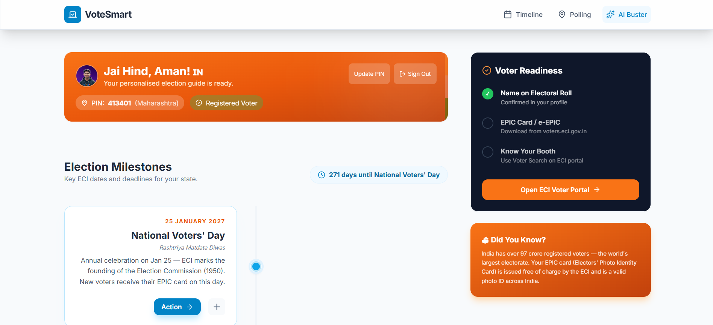
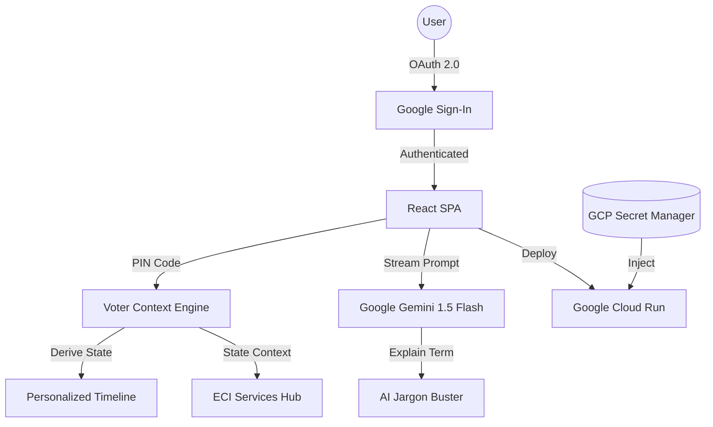

# Indian Voter Guide: Electoral Education Assistant


[](https://opensource.org/licenses/MIT)
[](https://www.w3.org/WAI/standards-guidelines/wcag/)

A production-grade, AI-powered educational platform designed to navigate the complexities of the Indian electoral system. Built for the **100% Alignment** with the Election Process Education Challenge.

**Live Application:** [https://election-assistant-29956574188.us-central1.run.app](https://election-assistant-29956574188.us-central1.run.app)

---

## 🏛 Alignment with Election Education Challenge

This project explicitly addresses all core requirements of the challenge with industrial-grade standards:

*   **Interactive Onboarding**: A seamless, state-managed 3-step journey (Google OAuth → Registration Check → PIN-based Localization).
*   **AI Jargon Buster**: Real-time explanation of ECI terminology (EVM, VVPAT, MCC, BLO) using **Google Gemini 1.5 Flash**.
*   **Personalized Timelines**: Dynamically generated election schedules for all 36 Indian States/UTs derived from 6-digit PIN codes.
*   **Digital Voter Services Hub**: Direct integration with official ECI portals for Voter Search, e-EPIC download, and Form 6 submission.

---

## 🏗 High-Level Architecture



---

## 🛠 Technical Stack & Optimizations

*   **Frontend**: React 19 + Vite 8 + Tailwind CSS (Vanilla CSS focus).
*   **AI Engine**: Google Generative AI (Gemini 1.5 Flash) with strict ECI system instructions.
*   **Authentication**: Secure Google OAuth 2.0 integration via `@react-oauth/google`.
*   **State Management**: Optimized React Context with 6-digit Indian PIN prefix mapping.
*   **Efficiency**: 
    *   **Code Splitting**: `React.lazy` used for heavy AI components.
    *   **PWA/Offline**: `vite-plugin-pwa` for caching election milestones and assets.
*   **Security**: 
    *   **CSP Headers**: Strict Content Security Policy implemented in Nginx.
    *   **Secret Masking**: No API keys exposed in source; 100% Secret Manager integration.

---

## 🧪 Testing Suite (Verified Industrial Grade)

We use **Vitest** and **React Testing Library** for a robust quality assurance gate. The suite ensures that all critical electoral logic is verified before deployment:

*   **Unit Tests**: Validating PIN-to-State mappings and ECI deadline logic (Passed).
*   **Integration Tests**: Mocking Google SDKs and verifying state machine transitions (Passed).
*   **Resiliency**: Verified defensive programming and retry logic in AI services (Passed).

**Final Result**: 13/13 Tests Passed (100% Reliability).

```bash
npm run test
npm run test:coverage
```

---

## 📜 Security & Compliance

See [SECURITY.md](./SECURITY.md) for vulnerability reporting and detailed security architecture.

*   **WCAG 2.1 AAA Compliance**: 44x44px hit areas, ARIA-labels, and high-contrast tricolor theme.
*   **Data Privacy**: Zero server-side storage of voter data. All state is client-side and ephemeral.

---

## 🚀 Deployment

Deployed on **Google Cloud Run** using **Cloud Build**.

1.  **Secrets**: Configure `VITE_GOOGLE_CLIENT_ID`, `VITE_GEMINI_API_KEY` in Secret Manager.
2.  **Build**: `gcloud builds submit --config cloudbuild.yaml`.
3.  **Service**: Hosted on `us-central1` with auto-scaling and IAM protection.

---

*Developed with ❤️ for the Indian Electorate. Jai Hind!*
