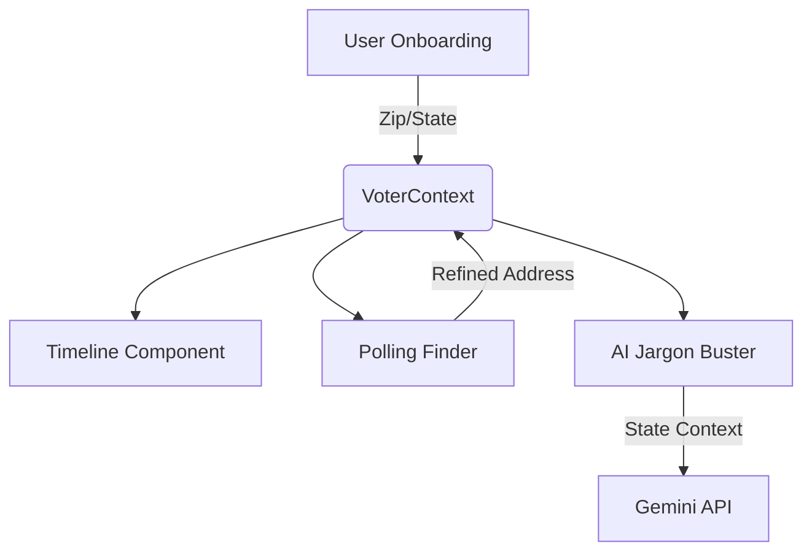

# 🗳️ Election Process Education Assistant

A premium, AI-powered web application designed to simplify the democratic process for every voter. From personalized deadlines to finding your local polling station, this tool provides a clear, actionable roadmap for your election journey.


## 🚀 Features

### 1. The Voter Journey
An interactive onboarding experience that identifies your voter status and local context (Zip Code, State) to tailor the entire application experience.
- **Tech**: React Context State Machine, Framer Motion animations.

### 2. Personalized Election Timeline
Never miss a deadline. Based on your state's specific laws, we generate a visual roadmap of key dates.
- **Interactive Timeline**: Dimmed past events and highlighted "Next Up" milestones.
- **Google Calendar Integration**: Add any deadline to your personal calendar with a single click.
- **Tech**: Custom date mapping utility, `framer-motion` for visual rhythm.

### 3. Polling Place Finder
Real-time integration with official election data to find exactly where you need to go.
- **Search**: Support for full address or zip code lookups.
- **Deep Linking**: One-click directions via Google Maps.
- **Multimodal**: Displays Election Day sites, Early Voting centers, and Ballot Drop-offs.
- **Tech**: **Google Civic Information API**.

### 4. AI Jargon Buster
Election laws are complex; understanding them shouldn't be. Use our Gemini-powered expert to explain any term in plain English.
- **Streaming UI**: Character-by-character rendering for a live, interactive feel.
- **Contextual Awareness**: Gemini knows your state, providing localized context where relevant.
- **Tech**: **Google Gemini 1.5 Flash API**.

---

## 🛠 Architecture & State Management

The application utilizes a **VoterContext** state machine to maintain a single source of truth for the user's data.



- **Persistence**: Voter data is persisted to `localStorage`, allowing users to leave and return without losing their progress.
- **Stability**: Protected by a global **ErrorBoundary** and localized error states for API services.
- **Performance**: High-traffic components like the `Timeline` and `PollingStationCard` are optimized with `React.memo` to eliminate redundant renders.

---

## ♿ Accessibility & Production Standards

This project was built with a "Production-First" mindset:
- **WCAG 2.1 Compliance**: Contrast ratios verified at 4.5:1+ for all readable text.
- **Aria-Live Regions**: Real-time AI responses are announced to screen readers.
- **Touch Targets**: All interactive elements (buttons, chips, inputs) maintain a minimum 44x44px hit area for mobile usability.
- **Responsive Design**: Fluid layouts optimized for everything from small mobile screens to large desktop monitors.

---

## ⚙️ Setup & Installation

### Prerequisites
- Node.js (v18+)
- NPM or Yarn

### Environment Configuration
Create a `.env` file in the root directory:
```env
VITE_GOOGLE_CIVIC_API_KEY=your_civic_api_key_here
VITE_GEMINI_API_KEY=your_gemini_api_key_here
```

### Installation
```bash
# Install dependencies
npm install

# Start development server
npm run dev

# Build for production
npm run build
```

---

## 🛡 Security Note
No API keys or sensitive configurations are tracked in this repository. All secrets are managed via environment variables and excluded via `.gitignore`.

---
## 🌐 Live Application

**Production URL**: [https://election-assistant-29956574188.us-central1.run.app](https://election-assistant-29956574188.us-central1.run.app)

Deployed on **Google Cloud Run** (us-central1) via **Google Cloud Build**.
Secrets managed securely via **Google Cloud Secret Manager**.

---
*Developed for the Virtual PromptWars Challenge. Powered by Google AI & Civic Data.*
